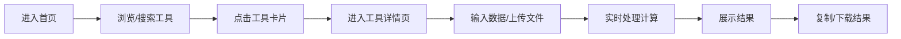

## 1. 产品概述

暮光工具箱是一款面向开发者和普通用户的在线工具合集网站，提供数十种实用的浏览器端工具，所有数据处理均在本地完成，保护用户隐私。

- **核心价值**：一站式解决日常开发、设计、生活中的小工具需求，无需安装，即开即用
- **目标用户**：开发者、设计师、学生、办公人群
- **产品定位**：简洁优雅的暮光主题风格，功能丰富且完全免费的在线工具箱

## 2. 核心功能

### 2.1 用户角色

| 角色 | 注册方式 | 核心权限 |
|------|----------|----------|
| 访客用户 | 无需注册 | 使用所有工具功能，数据本地存储 |

### 2.2 功能模块

1. **首页**：工具分类导航、搜索功能、热门工具推荐
2. **文本工具**：字数统计、大小写转换、Base64编解码、URL编解码、密码生成器、随机文本生成
3. **开发工具**：JSON格式化、UUID生成器、颜色转换器、正则表达式测试、进制转换
4. **计算工具**：单位换算、百分比计算器、年龄计算器
5. **图片工具**：图片压缩、格式转换、尺寸调整

### 2.3 页面详情

| 页面名称 | 模块名称 | 功能描述 |
|----------|----------|----------|
| 首页 | 顶部导航 | Logo、搜索框、主题切换 |
| 首页 | 分类导航 | 工具分类卡片，点击筛选对应分类工具 |
| 首页 | 工具网格 | 展示所有工具卡片，支持搜索筛选 |
| 工具详情页 | 工具操作区 | 对应工具的输入输出界面 |
| 工具详情页 | 侧边栏 | 相关工具推荐、工具说明 |

## 3. 核心流程

用户进入首页 → 浏览或搜索工具 → 点击工具卡片进入详情页 → 使用工具进行操作 → 结果实时展示 → 可复制或下载结果

## 4. 用户界面设计

### 4.1 设计风格

- **主色调**：深紫色系（暮光主题），主色 #6366f1，辅助色 #a855f7，背景深色渐变
- **按钮风格**：圆角胶囊按钮，渐变背景，悬停有微缩放和发光效果
- **字体**：标题使用现代无衬线字体，正文使用清晰易读的字体
- **布局风格**：卡片式布局，毛玻璃效果，柔和阴影
- **图标风格**：简约线性图标，配合 emoji 增加趣味性

### 4.2 页面设计概览

| 页面名称 | 模块名称 | UI 元素 |
|----------|----------|---------|
| 首页 | Hero 区域 | 渐变背景、大标题、搜索框、动画效果 |
| 首页 | 分类卡片 | 图标、分类名、工具数量、悬停动效 |
| 首页 | 工具网格 | 工具卡片、图标、名称、描述、分类标签 |
| 工具详情页 | 操作区 | 输入框、按钮、结果展示、复制按钮 |
| 工具详情页 | 侧边栏 | 相关工具列表、使用说明 |

### 4.3 响应式设计

- 桌面端优先设计，适配移动端
- 平板端：工具网格从4列变为2列
- 移动端：工具网格变为单列，导航简化为汉堡菜单
- 触摸优化：按钮和可点击区域增大，适合手指操作

### 4.4 视觉特效

- 页面加载时的渐入动画
- 工具卡片悬停时的上浮和发光效果
- 深色/浅色主题切换动画
- 暮光渐变背景，带有微妙的动态光斑效果
