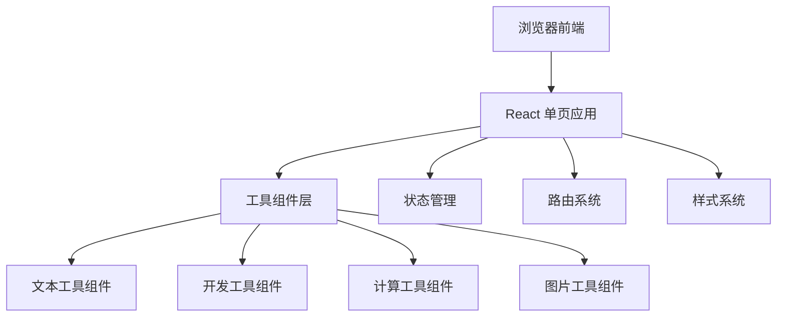

## 1. 架构设计



## 2. 技术选型

- **前端框架**：React@18 + TypeScript
- **构建工具**：Vite
- **样式方案**：TailwindCSS@3
- **路由**：React Router DOM
- **图标**：Lucide React
- **后端**：无（纯前端应用，所有逻辑在浏览器端执行）
- **部署**：静态文件部署

## 3. 路由定义

| 路由 | 页面 | 说明 |
|------|------|------|
| / | 首页 | 工具分类展示、搜索、工具网格 |
| /tool/:toolId | 工具详情页 | 具体工具的操作界面 |
| /category/:categoryId | 分类页 | 按分类展示工具列表 |

## 4. 数据模型

### 4.1 工具数据结构

```typescript
interface Tool {
  id: string;
  name: string;
  description: string;
  icon: string;
  category: string;
  path: string;
  component: string;
  tags: string[];
}
```

### 4.2 分类数据结构

```typescript
interface Category {
  id: string;
  name: string;
  icon: string;
  description: string;
  color: string;
}
```

## 5. 工具清单

### 5.1 文本工具
- 字数统计
- 大小写转换
- Base64 编解码
- URL 编解码
- 密码生成器
- Lorem Ipsum 生成器

### 5.2 开发工具
- JSON 格式化
- UUID 生成器
- 颜色转换器
- 正则表达式测试
- 进制转换

### 5.3 计算工具
- 单位换算
- 百分比计算器
- 年龄计算器

### 5.4 图片工具
- 图片压缩
- 图片格式转换

## 6. 性能优化

- 工具组件按需加载（React.lazy + Suspense）
- 使用 React.memo 优化渲染性能
- 图片懒加载
- 本地缓存用户偏好设置
